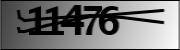
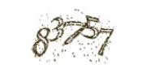
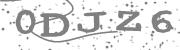

# captchas_universal

Пользовательское решение для автоматического обучения модели и последующего ее использование для распознование любых текстовых капч.

**Примеры:**
     

## Подготовка данных для обучения модели

Пользователю необходимо собрать и разметить от 3000 до 6000 изображений капч, для обучения модели.

Требования к выборке и разметка:
- Формат изображений jpg или png.
- Все изображения должны быть одинакового размера при обучение, так и при использование обученной модели.
- В название каждого изображения написать символы изображенные на картинке. В том же порядке и регистре.
- [Пример размеченного датасета для обучения.](https://gitlab.tm.biz-apps.ru/bolotov.r/captchas_universal/-/tree/main/data_for_training)

## Установка модулей и окружения

Необходимые версии для запуска скипта на Windows через командную строку:

Python==3.11.6
pip==23.2.1

остальные модули устанавливаем через команду:
*pip install -r requirements.txt*

## Запуск скриптов
 
**Скрипт model_training.py**

Используется для автоматического обучения модели на подготовленном и размеченном наборе данных, как указано выше.
- На вход - папка с размеченными изображениями капч. [Пример](https://gitlab.tm.biz-apps.ru/bolotov.r/captchas_universal/-/tree/main/data_for_training) 
- На выходе - обученная модель - *model.h5*, и файл с метками классов - *num_to_char.json*

Параметры:

    -f Путь к папке с подготовленными размеченными изображениями.
    -m Путь к папке куда сохранять обученную модель.
    -j Путь к папке куда сохранять файл с метками классов.
    *python model_training.py -f "C:\Users\Капчи" -m "C:\Users\результат" -j "C:\Users\результат"*

Предупреждения и сообщения об ошибках в выборке:

- **"Качество обученной модели 0.90"**  *(выводится всегда, показывает точность модели на валидации)*

- **"Не все изображения одинакового размера, проверьте изображения  ['0334421.jpg', '335320.jpg']"** *(выводится в случае если в выборку попали изображения не одинакового размера, все  такие  изображения перечисляются в списке)*
        
- **"Качество низкое, увеличите количество размеченных изображений"** *(выводится в случае если качество обученной модели менее 70%)*

**Скрипт recognition.py**

Используется для непосредственного распознования капчи, на основе модели и меток классов полученных в результате запуска скрипта *model_training.py*.
- На вход - обученная модель - *model.h5*, и файл с метками классов - *num_to_char.json*
- На выходе - результат распознования изображения, строка с символами - "6HT8".

Параметры:

    -i Путь к файлу с изображением
    -m Путь к файлу с моделью
    -j Путь к файлу с метками классов
    *python recognition.py -i "C:\Users\image.jpg" -m "C:\Users\model.h5" -j "C:\Users\num_to_char.json"*
